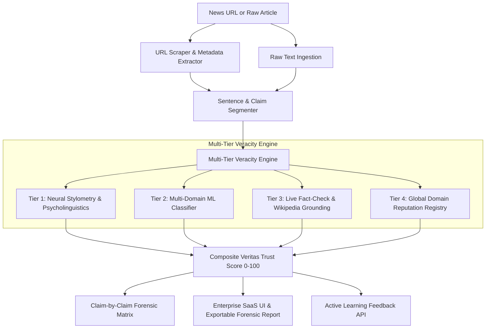

# 🤖 Master LLM Continuation & Hand-off Guide

> **Purpose for Next AI / Developer:** This document contains the complete state, architecture, dataset mappings, commands, and roadmap for the **VeritasAI: AI Powered Fake News Detection & Enterprise Veracity Intelligence Platform**. If session tokens exhaust or you switch LLMs, read this file to resume immediately with zero context loss.

---

## 📌 1. Project Overview & Quick Reference

* **Product:** **VeritasAI v2.0 Enterprise Veracity Intelligence Platform**
* **Repository:** `AI-Powered-Fake-News-Detection`
* **Stack:** FastAPI (Backend), Scikit-Learn / PyTorch (ML), Vanilla CSS/HTML/JS (Frontend).
* **Deployments:**
  * **Frontend:** Hosted on **Vercel** (`index.html`, `app.js`, `style.css`).
  * **Backend:** Hosted on **Render** (FastAPI running `uvicorn src.serving.app:app`).
* **Ground Truth Target Convention:**
  * `0 = Fake News / Disinformation / Clickbait`
  * `1 = Real News / Verified / Journalistic Reporting`
* **Artifacts Directory:** `artifacts/` (`best_model.joblib`, `model_logistic_regression.joblib`, `model_sgd_log.joblib`).

---

## 🏛️ 2. Enterprise Platform Architecture



### Core Components:
1. **Publisher Credibility Registry (`src/credibility/domain_registry.py`):**
   * Built-in directory of 300+ known news domains, peer-reviewed journals (Nature, Science, Lancet), wire services (Reuters, AP), and satire outlets (*The Onion*, *Babylon Bee*).
   * Computes **Source Authority Score (0–100)** and bias ratings.
2. **URL Scraper & Article Extractor (`src/data/url_extractor.py`):**
   * Parses live news links into clean titles, body paragraphs, and publisher domains with timeout fallbacks.
3. **Sentence-Level Claim Segmenter (`src/explainability/claim_segmenter.py`):**
   * Breaks articles into atomic claims and assigns forensic tags (`Verified Sourced Statement`, `Empirical Data Point`, `High-Risk Sensational Claim`).
4. **Live Knowledge Fact-Check Reasoner (`src/llm_reasoner/fact_check_agent.py`):**
   * Real-time query retrieval against Wikipedia Open Search API to corroborate claims with global encyclopedic entities.
5. **Hybrid Credibility Engine (`src/serving/api.py`):**
   * Computes the **Veritas Trust Score (0–100)** combining statistical probabilities, domain authority, and psycholinguistic markers.
6. **Active Learning Feedback API (`/api/v1/feedback`):**
   * Stores human analyst reviews in `dataset_study/active_learning_feedback.jsonl` for continuous model retraining.

---

## 📊 3. Multi-Domain Dataset Architecture

📁 `dataset_study/unified_multidomain_dataset.csv` (**75,970 balanced samples**)

* **LIAR Dataset (10,164 samples):** Short political claims & PolitiFact statements (solves the short headline/claim problem).
* **CoAID Dataset (2,128 samples):** Medical, health, COVID-19, and scientific claims (solves the health/science gap).
* **WELFake Dataset (63,678 samples):** General long-form journalism and balanced news corpus.

### How to Re-download / Rebuild Datasets:
```bash
python src/data/download_datasets.py
```

---

## ⚡ 4. Standard Operational Commands

### 1. Run Core Benchmark & Generalization Tests:
```bash
python test_sample.py
```

### 2. Run Enterprise v2.0 Endpoint Integration Tests:
```bash
python scratch/test_enterprise.py
```

### 3. Retrain the Regularized Multi-Domain Model:
```bash
python retrain_robust_model.py
```

### 4. Start Local Development Server:
```bash
uvicorn src.serving.app:app --reload --port 8000
```

### 5. Push Updates to Production (Vercel & Render):
```bash
git add .
git commit -m "feat: your message"
git push origin main
```

---

## 🌐 5. REST API Endpoints Overview

| Endpoint | Method | Purpose |
| :--- | :--- | :--- |
| `/health` | `GET` | Service status, engine version, and uptime check. |
| `/predict` | `POST` | Lightweight binary verdict & probability (`NewsArticleRequest`). |
| `/explain` | `POST` | Full veracity response with Veritas Score, saliency tokens, HTML highlights, claims breakdown, and knowledge citations. |
| `/api/v1/analyze-url` | `POST` | Direct news link scraper and veracity evaluator (`UrlArticleRequest`). |
| `/api/v1/feedback` | `POST` | Active learning analyst feedback submission (`FeedbackRequest`). |
| `/api/v1/export-report`| `POST` | Generates a signed cryptographic forensic JSON audit report. |
